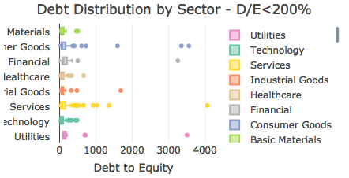
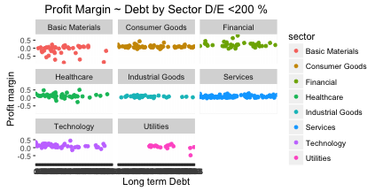

## Background and definitions

- This short presentation explores the relationship between debt to equity (D/E ) and profit margins of publicly traded companies
- The analysis is limited to companies that belong to the Standard & Poor's 500 index.These are among the largest companies in North America 
- The presentation only covers the exploratory part of the data
- An accompanying shiny web app gives further details into the data
- The initial data was downloaded from www.FinViz.com and serves to support this assignment only

---
## Description of the analysis
- Covers companies that are members of the S & P 500 index (500 companies)
- Companies with incomplete information were excluded, resulting in 397 companies
- We explore the relationship of debt to net margins  by sector
- To normalize the debt of companies the debt to equity ratio is used (ltdeb) instead of the dollar value of debt
- To avoid outliers, in the graphs we have limited company's D/E ratios to 200% or lower

### Definitions:
- Mkt capitalization: refers to the total dollar market value of the company's outstanding shares ( mktcap)
- Debt to equity ratio: refers to the relative proportion of shareholders' equity to debt(ltdeb)
- Net Profit Margin: net proft divided by sales(pm)

---

## Data Summary

|sector           | numberofstocks| median_mktcap| median_debt| median_gm| median_om| median_pm|
|:----------------|--------------:|-------------:|-----------:|---------:|---------:|---------:|
|Technology       |             63|      19.28716|        46.0|      58.9|     17.90|     12.80|
|Industrial Goods |             41|      17.76298|        66.0|      30.7|     12.60|      8.70|
|Basic Materials  |             44|      21.32035|        70.0|      36.1|      5.25|      1.80|
|Healthcare       |             41|      25.67166|        74.0|      64.9|     16.30|     12.00|
|Consumer Goods   |             63|      18.50646|        77.0|      38.9|     12.50|      8.20|
|Services         |             87|      16.00509|        78.0|      37.3|     11.70|      7.20|
|Financial        |             38|      16.49506|       108.5|      69.0|     24.75|     19.25|
|Utilities        |             22|      20.17010|       123.5|      71.4|     19.45|      9.55|

---

## Distribution of debt by sector

Initial Observations:

1. There is variability in levels of debt by sector. Basic Materials and Financials are among the sectors with the highest median Debt to Equity levels

2. This variability in debt levels does not seem to have a clear corresponding relationship with profit margins. For the most part profit margins follow a horizontal band, independent of the levels of debt

3. We conclude that debt, by itself, does not have a material impact in profit margins. 
